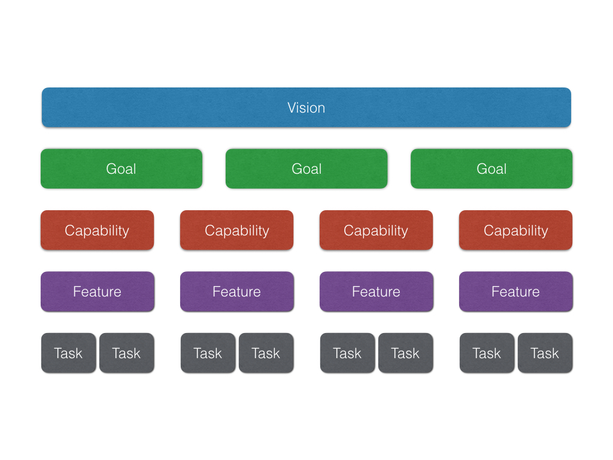

# Agile Planning

Both words, "agile" and "planning", mean different things to different people. In this article I hope to provide an overview of agile planning without going into specific implementations like Scrum or Kanban whilst still providing practical advice for any implementation.

For the purpose of this article, agile planning refers to the organisation of teams and work in order to deliver value iteratively. You might consider it a strategy where planning is not a phase and is not completed ahead of implementation but instead happens frequently during a delivery, enabling teams to adapt to change.

## Start with the value

Every project will want to provide value to an organisation or person. If we choose agile we may not plan and document everything up front but we'll always be working towards a known, or partially known, value. It makes sense then to understand the shapes that value can take and work out what high level value we want to achieve.

We can group our value into 5 abstractions. Each deal with a different unit, each with their own stakeholders to whom they provide value.

 - **Vision** is the central mass that holds the project together
 - **Goals** are quantifiable measurements of value
 - **Capabilities** are provided in order to reach goals
 - **Features** implement capabilities
 - **Tasks** are the units of work that produce features

You can read more about these units in Liz Keogh's article on estimating complexity. She first introduced me to this idea and it's stuck with me ever since.

 - https://lizkeogh.com/2014/06/06/goals-vs-capabilities/
 - https://lizkeogh.com/2013/09/05/capability-based-planning-and-lightweight-analysis/

Even if you haven't knowingly defined these units before, your project will likely have them. They are natural artifacts of software engineering projects. Your team may not be aware of the vision, but your product owner or the manager ensuring the projects completion should do. Your team may be asked to complete a set of features without being given the freedom to consider alternative ways of providing capabilities.

> Start with a vision and goals that work towards it

I hope those reading this article, those that haven't always identified vision and goals, capabilities and features, will be able to identify them in future. Even better, have the team understand and help define them. If you do not have a vision and set of related goals defined for your product or project, grab your team and stakeholders and define them now.

## Layers of agile delivery

You could see the project's vision, goals, capabilities, features and tasks each as interdependent layers. Each layer helps achieve the layer above them. Goals implement a vision, capabilities implement goals, features capabilities and so on. This is the direction of the dependence.

> Never assume a feature is the only way to provide a capability

When you think about the layers dependencies as travelling in a single direction, as a single direction of authority, you begin to think less in solutions and more in problems. You start with a vision, this is the highest authority. Your vision defines it's goals. Goals then require capabilities. Only then do our capabilities need features to implement them. Why then do we march into new projects with a bunch of features in our heads? Probably because they're the most tangible output of a project but that doesn't make it sensible, or agile at that.

A charity might have a vision to provide free access to travel for the elderly. A goal to measure the success of this vision might be to provide 10 elderly people free access to travel a week. Now in order to provide 10 elderly people free access to travel, we'll need a way of transporting them. Transportation is our capability. Only then do we consider a feature that provides this capability. We might choose taxi, bus, volunteer driver, spaceship or a mixture of them. The point is we haven't locked ourselves to a particular solution. We've left our options open.

When features become subservient to our capabilities, goals and vision we are no longer so attached them them. When we realise a feature is going to take too long to deliver we can consider our alternatives. When a goal needs to change, we are more inclined to let go of the capabilities and features as we know the success of our project is related to it's goals and not how those goals are implemented.

## Moving through the layers with iterations

Agile teams will use iterations to complete tasks. They might have several iterations for one task, or complete many tasks in a single iteration. What is common is the use of an iteration to receive feedback on work completed to ensure it's meeting expectations and providing value.

Iterations enable us to move down through the layers understanding the problem all the way down to individual tasks, and then we travel all the way back up solving problems at each abstraction.

> Be clear on your purpose, bring it back to the vision

During an iteration we travel through each layer in order to understand the problem. In order to decide on a feature we must understand what capability we are trying to provide, the vision and goals can help us make decisions.

We might only track tasks on our board and capabilities on our roadmap but it's always useful to keep the parent abstractions in mind. Write up your vision and goals above your boards and maps. At the beginning of every stand up, reiterate the feature you're working towards before describing the task you're stuck on, don't stick to the minutae, try and remember why you're doing the task in the first place.

> Focus on high quality output

At the end of every iteration you'll want something usable that you can put in front of stakeholders. It's the job of your team and stakeholders to be able to judge the output of the iteration against the projects goals. You therefore want a finished product in front of you at the end of every iteration.

What do we mean by finished product though? Well if you are iterating over the design of an interface, then that finished product would most likely be something more visual than functional. It would need to be finished though, you wouldn't want the text on a button missing, or some graphics being unrelated placeholders, you want the stakeholders to be able to buy into the vision and therefore everything needs to make sense.

As for web applications, they need to be working and all known bugs fixed. If you get to the end of an iteration and that isn't the case, your teams first job is to admit this and communicate their challenges. They can then pick this up later in their retrospective.

> Keep iterations short

If you're focussing on high quality output then keeping to shorter iterations can really help with that focus. By working on a small slice your team can focus on getting that done done.

You could choose to tackle the entire checkout in one iteration. However that's a lot of work to complete without receiving feedback. It's also a lot of work to ensure it's done done. It might be easier to take each step in the checkout as an iteration. You might even spend a couple of iterations on each checkout to ensure they're exactly what you need.

## Communication is key

Before, during and after an iteration communication will ideally be maintained between the team and stakeholders. Planning the next chunk of work, giving status updates and presenting a final showcase can all help with communication.

The main purpose for communication is to ensure everyone knows they are working towards the same goals. The team need to coordinate with each other. Stakeholders need to know when the team are blocked so they can help as necessary. Stakeholders also need to give feedback and answer the teams questions.

> Stakeholders won't always understand every layer

You may have product owners, or other stakeholders in your business join your stand ups. It is the teams responsibility to remember that the stakeholders may have decreasing levels of understanding as you go down the layers.

Sometimes it might make sense to split your stand up into two or more based on your audience. You don't need to spend any more time than usual, just exclude stakeholders from the really technical implementation details. You can go into the gory details of your deployment failure with the colleagues who understand your pain, spare the Head of Finance.

In order to be respectful to your audience and also provide them understanding, only go into as much detail as they will understand.

## Using ceremony to get things done

Many agile practices introduce ceremony. Scrum often includes estimation planning sessions. We already mentioned stand ups. Hopefully everyone is doing retrospectives.

> Use showcases to encourage communication, pace and achievement

We like to use showcases during and at the end of iterations. Typically occurring every 2-5 days the showcase will bring stakeholders and teams together. The team will have a polished showcase that has been well rehearsed and aimed at explaining the value of the work they're producing.  The team will end with any questions or blockers they have.

Explaining what goals along with the actual changes made allows the audience to understand the context in which the team have worked and assumptions the team have made. Communication is the main aim and feedback is always desired.

Another benefit of the showcase is encouraging pace. When the team knows a showcase is looming, they will learn to ensure they ready their current changes ahead of time into a polished state. It encourages them to think about the goal and the organisation rather than just cutting code.

Finally, a showcase is a time for the team and stakeholders to celebrate the new value and learnings that the last iteration provided. When everyone champions the process, the process thrives.

## Ever changing landscapes

Change is acknowledged and accepted by agile practices. At the end of an iteration we do not necessarily have to continue working with the same set of assumptions in the the next. When we built out a prototype and realise it's not going to do the job, we can reprioritise our roadmap and adapt for change.

> Prioritise by value

Never assume that a roadmap has to be set in stone. It should be fluid and adapt as you work through it. Items in the roadmap will need reordering. Sometimes you'll find a capability isn't even required after achieving a goal sooner than expected. Sometimes a problem you thought you had isn't a problem at all.

If a team sets out to deliver a particular feature over a number of iterations, but realises after the first iteration that what they've produced is releaseable, release it! Get users using it. You may find that it quells a need and you might find a different goal or capability to work towards after realising you're getting enough value already.

> Acknowledge scope will change

Another thing to remember is that scope can and should be variable. If your project has a hard deadline, you're going to end up reducing your initial scope. That's almost certain. Acknowledge that the image in your head of the final picture at the beginning of a project will never be the same as what you finally produce.

## Have the destination in sight

Not every delivery team will have a project with a deadline. We prefer thinking in a product mindset where delivery is continuous, visions and goals evolving as we go. That said, having a destination in sight is still important.

> Always be deploying

The initial phases of product development may result in UI/UX artifacts like wireframes or component libraries and these won't necessarily be deployable to end users but should be of high quality. You should aim to get through these phases within a few days or a few weeks at most. You want to be producing software that end users can use and provide you feedback in the form of real data whether that be automatically collect metrics or user surveys.

In a back office environment we aim to be handing over changes to end users every few days, a week at most. Getting things shipped means you can adapt your plan based on feedback. You'll never go too far down a rabbit hole, at most wasting an iteration or two which is a matter of days.

> Learn from mistakes with retrospectives

Moving fast your team will make mistakes and that's okay. You'll also have great successes too. No matter your flavour of agile, make sure you have regular retrospectives. You might have one at the end of your sprint if you're practicing Scrum. If you're using Kanban you might have one every 2 weeks.

Make sure you hold yourselves to account with your actions too. Keep a log of all retrospectives and their actions, always recap on all actions every retrospective until they no longer have value.

> Measure success against goals and vision

Finally, always measure your success against the vision and goals of your delivery. Yes shipping a new feature means you've put effort and completed something but the real success lies in whether that feature provides the desired value.
