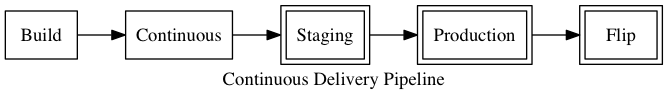

# Building a pipeline

_A more technical chapter on actually setting up the pipeline._

 * An overview of the pipeline
 * Small diagram displaying the steps in the pipeline
 * Discuss triggers, manual and automatic, at the different steps
 * Discuss tracking of these steps in the repository with tags and branches
 * Build steps and shell scripts - keep as much in repo as possible (shell scripts)
 * Overview of each step, it's triggers, where it pushes/tags to branches, following step, and whether automatic or manual step
 * Ownership of deploys, recording who triggered what and when (Jenkins with Users for example)
 * Having good communcation with team, before moving between steps
 * Variations on pipeline? Not sure if needed, but discuss option to have additional steps between staging and production that just pushes to a branch (manual step) that sits between actual deploys to those environments (automated after a push to branch)
 * Non-linear pipelines. Concurrent tests (smoke, performance)
 * [Original blog post](https://www.madetech.com/blog/continuous-delivery-with-jenkins)

***

## What is a pipeline?

A pipeline is a set of steps that your code takes to get from a developers local machine through to a production environment. This pipeline is managed by a tool (see previous chapter) that lets you define these steps, what they do, and how and when it proceeds onto the next one.

The pipeline is the tool used to deliver Continuous Delivery.

The steps in the pipeline you create is completely dependent on the application you want to deliver, and any processes you might have to get it verified into a production state.

## Common pipeline steps

Most commonly, the first step you'd have in the pipeline is one to collect all code that your team of developers are working on and to run automated tests. This practice is known as Continous Integration. All developers are pushing into a central code repository and comitting early and often. The pipeline will then run your automated test suites to make sure new code doesn't break. If any tests fail, then that code goes no further through the pipeline until it's fixed.

Once you have a good (?) build, steps that follow in the pipeline can involve deployments to various staging environments where your team, and perhaps your product owner can preview the code changes.

At the end of the pipeline is always your end product. Either a production deploy, or release of your application that is ready to be released to the end audience.

For the purpose of this article, we'll use an example pipeline structure based on a web application, consisting of the following steps:

 1. Build
 2. Continous
 3. Staging
 4. Production
 5. Production flip (for Blue/Green deployments)

Lets now talk about how we progress a new set of code changes through a pipeline.

## Triggers

Each step in your pipeline needs to be initiated by some means. These can be manual or automatic triggers. 

New builds through your pipeline should be triggered automatically when new code is pushed into your central code repository. This involves either periodic polling of the repository by your tool, or push notifications from the repository. Either of which will trigger a new build. This gets the ball rolling.

Proceeding steps are then triggered automatically on the success of the current step. And you continue to trigger steps in this manner, until your processes require you to have human verification of your application before it progresses through the pipeline. If your pipeline consists of nothing but automated steps, then you're also practising Continuous Deployment too.

However, you might require a product owner to sign off on new changes before they are progressed, or released. So a manual trigger is required for the pipeline to progress past a point. And these are normally a human clicking a button from within your tool of choice. Once clicked, the pipeline continues as normal until the next manual step (if any).

## Repository representation of the pipeline

With branches and tags in your source code control, you can easily mirror the state of your pipeline in your repository. Each of your pipeline steps can be configured to push the code into a branch of a matching name if it succeeds. Each step after will then pull from that branch. That branch represents the state of the pipeline after each has successfully completed.

When a build is triggered for a pipeline it's given a number. Making use of this number and a repository tag will give a good historical reference and make browsing different releases easier in tools such as GitHub. Or if you have a bug for a previous release, you can easily checkout based on a tag name (or branch) rather than trying to find a specific commit based on a date.

## Build step commands

Besides a step leading to another step, how do we get them to actually do something? Such as running tests, or deploying code?

All tools come with a mechanism to execute an action or actions for a particular step. Depending on which you're using, it might be an integration with another service online, or one that allows you to specify custom commands. These give you the most flexibiltiy if your needs are more complex.

You could list the various commands that your step requires to complete, one after the other in the pipeline tool configuration. However, it's good practice to use a shell script as that allows you to group those multiple commands into one, and to keep the script in your repository. Be descriptive with the names of your shell scripts. A step that needs to run tests? Why not have a script called `pipeline/tests`. Performance? `pipeline/performance`. Your pipeline tool then only needs to know of one command to run per step. And you've then got all the benefits of source code control for your pipeline logic, with the added benefit of being able to run these locally too.

It's worth noting that there might be limitations with what you execute at each step. If you have a self hosted tool (for example, Jenkins), then anything your scripts are running, you need to ensure those dependencies are on the system that Jenkins is running on. For example, if you're using `rspec` for tests, your system would need Ruby, Rubygems and rspec installed. If you're using a hosted tool, then build steps are usually run within virtual containers, and often the services allow you to install any of your step dependencies before they are run, or they have common virtual containers already that you can specify. For example, there might be a Ruby container that would already have most common dependencies in place.

## Breaking down our pipeline

Lets go into a bit more detail with our example pipeline. For each of the steps, we'll talk about the trigger, how it's linked to our repository, what it executes and what step happens afterwards.

### Build

 * **Purpose:** To ensure the latest code passes our tests and code standards
 * **Trigger:** Automatic by someone committing to the `master` branch of our repository.
 * **Pulls from branch:** `master`
 * **Executes:** `pipeline/tests`, `pipeline/code-standards`
 * **Success push branch:** `build`
 * **Success trigger:** Trigger the `continuous` step to run automatically

### Continuous

 * **Purpose:** To deploy the code to a staging area for the development team to preview and test. This allows us to check that all the code our developers have integrated together works as expected.
 * **Trigger:** Automaticly if the previous `build` step succeeded
 * **Pulls from branch:** `build`
 * **Executes:** `pipeline/deploy/continuous`
 * **Success push branch:** `continuous`
 * **Success trigger:** Create a manual trigger for the `staging` step as the next in the pipeline

### Staging

 * **Purpose:** To deploy code to a staging area for a client to preview.
 * **Trigger:** Manual if the development team are happy with the `continuous` deploy
 * **Pulls from branch:** `continuous`
 * **Executes:** `pipeline/deploy/staging`
 * **Success push branch:** `staging`
 * **Success trigger:** Create a manual trigger for the `production` step as the next in the pipeline

### Production

 * **Purpose:** To deploy to the production environment when the client is satisfied with the `staging` deploy.
 * **Trigger:** Manual if the client is happy with the `staging` deploy
 * **Pulls from branch:** `staging`
 * **Executes:** `pipeline/deploy/production`
 * **Success push branch:** `production`
 * **Success trigger:** Create a manual trigger for the `production-flip` step as the next in the pipeline

### Production flip

 * **Purpose:** After a final verification of the `production` in a production environment, flip live traffic to the new release of the application.
 * **Trigger:** Manual from the `production` deploy
 * **Pulls from branch:** `production`
 * **Executes:** `pipeline/deploy/production-flip`
 * **Success push branch:** n/a
 * **Success trigger:** n/a - you've reached the end of the pipeline!

## The pipeline and your team

Even with an automated pipeline, it's important to retain communication within your team throughout the development of features. You're more than likely using a chat application, so setting up integrations with your pipeline to notify users when a new build has passed or failed, is a great aid.

Before deploying between your various environments, it's always a good idea to communicate with the team to see if that's ok. For example, if you have clients using your staging environment to preview changes before they go to production, you might want to check these yourselves on the continuous environment before deploying. You may be happy with your own work, but your colleagues might want some time to check over their work before it continues up.

Most pipeline tools have good visibility on what changes triggered builds, and with manual steps, who triggered the build. This isn't to associate blame in the event something goes wrong, but it brings ownership to a deploy by having this visibility. 

## Variations

Even though the example we've used in this article is linear, not all pipelines need to be. A pipeline step could trigger multiple other steps allowing for different tasks to run in parallel. Unit tests, code standard checks and performance metrics are all things that could be run independently of one another.

The benefit of running tasks in parallel is a reduced feedback loop. This is the time it takes to know whether a pipeline build can continue or whether it fails. The quicker you have the result of a build failing, the quicker a resolution can be made.

Other variations to pipelines could include post-deploy tasks that run smoke tests on a deploy to ensure it was successful, or to run security checks. These would save the need for you having to do this manually, saving you time, and letting you know sooner when things aren't as they should.

## Improvements to your pipeline

Don't let your pipeline remain static and fixed once it has been setup. Be on the look out for tasks that you or your team perform manually that could be included in the pipeline process to automate instead. Because including that in one of your build steps might take an hour or less, but be thinking of the time that will save in the long run. Each time you manually perform that task, multiply it by the average number of builds you have each month, and that'll be your saving over the same time.
