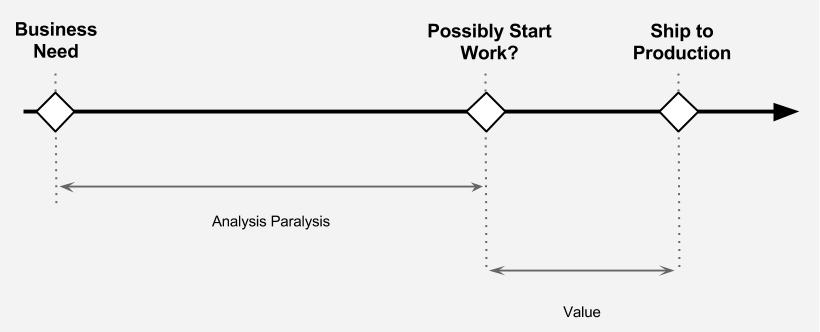

# Analysis Paralysis - Stop slowing down your enterprise!

So you are trying to build a fast moving digital organisation, one which responds to market opportunity, is decisive and can get things delivered. One of the challenges you may encounter is a thing we call Analysis Paralysis.

It's a problem that is prevalent in large enterprises and governments, where lack of trust, office politics, and siloing can cause over-analysis, leading to indecision, resulting in things grinding to a halt.

We see the most significant Analysis Paralysis occurring in the time that elapses between somebody trying to boot up a new initiative (Hey, we should do X!) and actually putting the proverbial shovel in the sand and making a start.

People working within organisations that face this problem often come up reasons to justify the lack of progress e.g "We need to get Enterprise Architects involved and they are too busy at the moment", "The business people haven't made a decision yet", "We've got a meeting in four weeks to discuss it further. That's the earliest all stakeholders could do" etc.

These sorts of excuses don't sit well with us, as we believe any organisation should be able to go from having a business need to having something in production within a few weeks.

So why does this problem exist in pretty much every big organisation we have seen? Why can some people in these organisations facilitate progress, whilst others cannot?

We believe it comes down to a few things:

1. **Strategy** - The team over at [GDS](https://www.gov.uk/government/organisations/government-digital-servicek) coined the phrase _"The Strategy Is Delivery"_ and we like this.

  We see many enterprises investing vast amounts of time into upfront strategy and deep analysis work before any actual work can begin. Although there is clearly value in doing some upfront thinking, much of the time organisations invest into strategy could be better spent on delivery and getting something to market quicker.

2. **UX / UI** - We still come across organisations who invest significant time into BUFD (Big Up Front Design) at the UX layer. Iterating through rounds-and-rounds of wireframes and then rounds-and-rounds of UI design before moving into Templating (HTML/CSS/JS etc).

  Although this can give the illusion of progress, without shipping (e.g. launching into a production environment), they are creating artefacts and not delivering true value. It's just another form of analysis paralysis.

3. **Chunking** - We often see decision makers that lack enough technical knowledge to sensible chunk work. Booting up large programmes which invariably require much closer scrutiny due to increased expenditure and risk.

4. **Architecture** - Another area where we see analysis paralysis taking place is in system architecture. Much time can be invested into working out the perfect system design, from overthinking API structures to designing all encompassing Common Platforms and general [Gold Plating](https://en.wikipedia.org/wiki/Gold_plating_(software_engineering)).

## Lean Inception

One of the techniques we've used to help businesses get through Analysis Paralysis is to use a Lean Inception. It's an approach which is useful when there is uncertainty within the business about how to move forward with a particular topic.

Our inception sessions will nearly always happen face-to-face and include the cross-functional delivery team. They will be chunked correctly, so something small enough to be delivered in a reasonable time period, but significant enough to provide business value. The session will typically be structured something like this:

1. **Problem Statement** — Person driving the project and team agree on the problem that you're trying to solve.
1. **Actors** — Agree the [actors](https://tcagley.wordpress.com/2015/03/31/the-difference-between-a-persona-and-an-actor/) involved and gain a high-level understanding of their needs. Ideally have somebody present who represents each actor.
2. **Process Map** — Draw out the existing process that you are trying to improve. Doing this will provide clarity to everyone in the room.
3. **Problem Areas** — Highlight the problem areas and prioritise these by business impact.
4. **Real Actors** — Now go and sit with the actors in the system, to see the problems you're solving first hand.
5. **Revisit Process Map** — We often find the sitting with real actors changes the

Up until this point, we'll have focused on the problem. We'll now turn our attention to potential solutions.

4. **MVP Definition** — As a team agree on a small slice that can be delivered quickly and can be used to test assumptions with the actors. Depending on the problem you're solving, this could be a spike / prototype or a real thing that an actor starts using daily.
5. **Delivery** — Spend a few days (or maximum a few weeks!) working on delivering a first slice. Get it into the hands of the actor to get some feedback as soon as possible. You should have cross-functional team, so delivering things that are UX'd, built, tested and in a production like environment.
6. **Capture Feedback & Iterate** - Keep refining your MVP definition and learning more about the solution as you showcase to the actors.

Within a few weeks you should have learnt lots and know whether the path you're taking is going to meet the business needs.

You may decide to continue investing time into the solution, move onto something else or even shut the delivery down. Whichever route is taken, you'll have minimised the investment, developed learnings and avoided a lot of the upfront analysis which can paralyse many organisations.

Give this lightweight approach a go and let us know how you get on!
