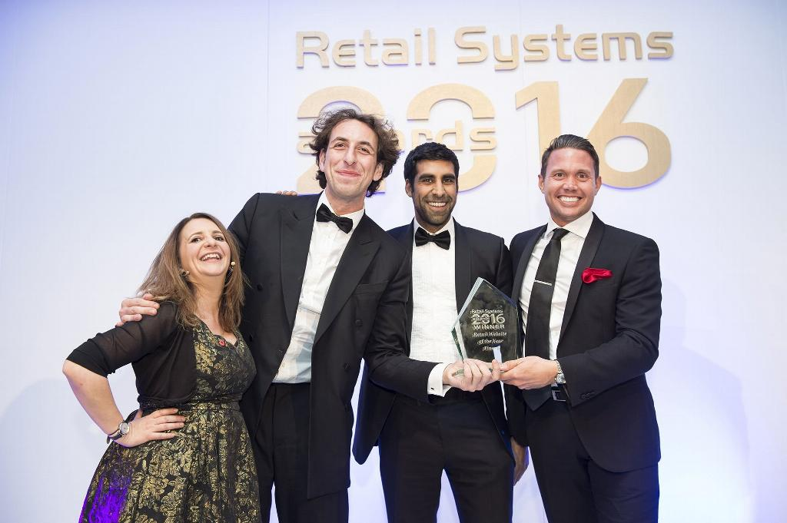

# Finery awarded Website of the Year at Retail Systems 2016

We're incredibly proud to announce that the website we built with the team at Finery has been named Website of the Year at [the Retail Systems 2016 award show](http://www.retail-systems.com/awards/winners16.php).

Finery, an online womenswear retailer, first came to us in 2014 with the goal of launching their ecommerce platform. Over the next year or so, we worked with them to develop an online store that would meet the needs of their customers, whilst maintaining the level of class the Finery brand represents.

After delivering an initial, invite-only release within three months, which allowed us to gather data from real users without opening the floodgates, we launched the Finery store to the public in February 2015. The Finery team have since gone on to achieve massive success, with online sales reaching an incredible [£5 million in their first year](http://www.telegraph.co.uk/finance/newsbysector/retailandconsumer/12143644/Finery-toasts-5m-sales-in-first-year.html).
