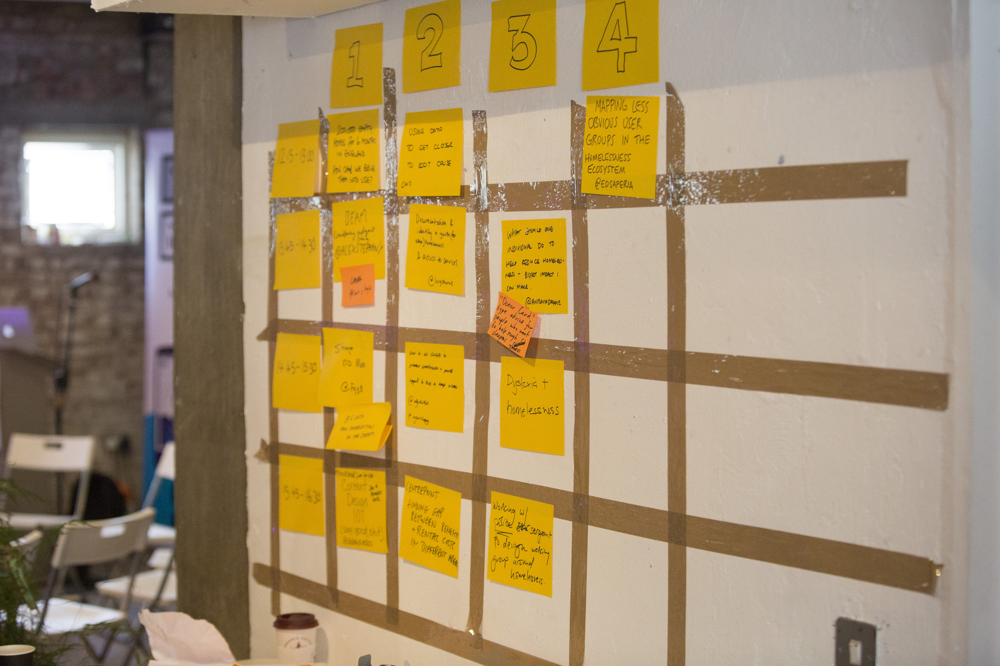

# Homeless Hackday London

At Made Tech, we run an internal Hack Day or Learning Day every month. We take time off our paid work to focus on learning something new (like a new programming language) or to hack together some tools that solve a problem we're encountering. 

Some of our recent hack days have covered:

* Learning Kotlin
* Uncle Bob's Clean Architecture
* Creating a Smart Office
* Hardening Security
* Making Computer Games
* Creating Dashboards / Information Radiators 

Historically these days have been internally facing, with someone pitching an idea and just our team in attendance. This month we decided to try an alternate format, we used the time allocated to attend a public hack day called Homeless Hack. 

I thought I'd share some of the thinking behind this and take you through what we created at the hack. Hopefully this will inspire some other organisations to follow suit and use hack days for good!

#### Default to open
We have always been an open company and publishing our [company handbook](https://github.com/madetech/handbook), [frequently blogging](https://www.madetech.com/blog), [mentoring new programmers](https://github.com/madetech/handbook/blob/master/roles/engineer.md#mentor) or [writing books](https://www.amazon.co.uk/Building-High-Performance-Agile-Teams/dp/1544972687) were steps towards being even more open. It felt at odds with our culture to run hack days that were closed events. Homeless Hack was a good opportunity to rectify this. 

#### Be a socially responsible SME
Historically we've never given much thought to things like Corporate Social Responsibility. We're an SME, we've got less than 30 people working for us and we like to think we run the business ethically and fairly. 

It's always felt like the world of CSR didn't really apply to us. e.g. It's for the big enterprises, who do bad things and need to offset the bad things by doing some good things. This was a good opportunity to course correct some of our thinking around this and invest some time and money into something that would do some social good. 

#### What are you doing on Saturday?
We asked everyone in the company to attend HomelessHack, though had just 7 people attend. The event fell on a Friday and Saturday and many people couldn't give up a day of their weekend to attend. Interestingly, we had quite a few people who originally said they would attend, but as the event got closer, had to drop out.

From a cost perspective, it will have cost us ~£6,000 in lost opportunity costs (as our billings on Friday will be down) and approx ~50% of this in direct costs. So it's a fairly significant investment for an SME, but one which we think is justifiable and worthwhile. 

## Day 1 - Learn
We kicked off Homeless Hack on Friday morning with an introduction followed by talks by X, Y & Z. These talks really helped to set the scene and get a deeper understanding of the problem and potential areas for focus.

Following the talks, a load of people presented ideas for discussion in the afternoon. We pitched a couple of things: The first was to look at Property Guardianship and whether there was a potential source of additional housing and what policy / social / changes would be needed. The second idea was around data and sources of insight which could be used to drive policy change.

Following afternoon discussions, we had a short session to aggregate ideas and break into teams to work on particular problems. There were ~5 teams in total and we were part of the [Shared Accommodation Rate](https://docs.google.com/document/d/1h349A0oM5-SHuyvwoLX9VfDsq2t4EeC9LnvSm2BfN9Y/edit?usp=sharing) and the [XXX]() teams.

The objective for the SAR team was to: **Use real pricing data to create a campaign to highlight the difference between LHA and real market rates**

The objective for the XXX team was to: "Insert Here"

## Day 2 - We're Live

## What's Next
It looks like Homeless Hack is gaining momentum. I've seen Homeless Hack events organised in Leeds, Manchester and Oxford. It's great to see the good work being picked up by other cities. 

As a company, we'll definitely be attending more public hack days. We're already talking about the next one, potentially an [NHS Hack Day](http://nhshackday.com/) and we're hoping to get a larger turnout from Made Tech next time! 

Finally, a huge thank you to [Janet Hughes](https://twitter.com/janethughes), [James Cattell](https://twitter.com/jacattell), [Gia Marcus](https://twitter.com/la_gaia) & [Richard Barton](https://twitter.com/cioportfolio). They organised the London event and made it a fantastic success. These type of events wouldn't happen without their hard work, so top work to them all. 