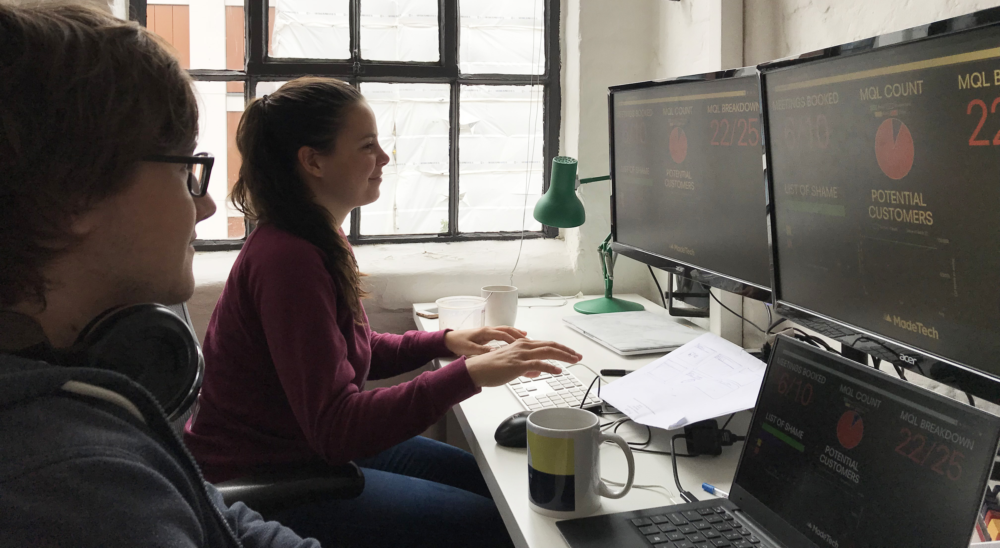
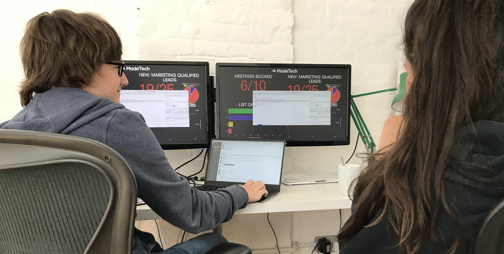

# Introducing: The Made Tech Academy

We're excited to announce the launch of a brand new initiative for our company: The Made Tech Academy.

## What is the Academy?

The Academy is a yearly intake of fresh-faced software engineers looking to break into the industry, from university graduates through to self-taught individuals, and from all walks of life.

Running for 12 weeks each summer, Academy members will be tutored by one of the Made Tech team in what we believe are the skills needed to deliver great software, such as Test Driven Development, Agile and Continuous Delivery (you can get a head start on this with [our book](https://www.madetech.com/resources/ebook/building-high-performance-agile-teams)). Whilst there's a fair amount of focussed learning during the 12 week period, Academy members will also have the opportunity to join project teams and gain experience working with customers.

All positions in the Academy are paid, and at the end of the 12 week period members will join one of our delivery teams.

## Meet our first students
Joining the academy in its first year are Tasmin Steer and Dan Burnley. Having been with us for a number of weeks already, they were kind enough to answer a few questions about their experiences within the company so far:

### What’s your background in software engineering?

**Tasmin:** I learnt to program during my Masters degree in Computer Science. As part of the course I did a Software Engineering unit - we worked in teams to make a game. I really enjoyed this unit, so for my dissertation I decided to develop a web application for sports teams. The dissertation was challenging at first, but it gave me good insight into software engineering and really improved my programming skills.

**Dan:** Within education - Computing A level and Computer Science at universtity. Taught myself basic programming/sysops stuff in my spare time, but learnt things in more detail through university and my placement.

Outside of education I've done minor freelance work setting up a website using a CMS, and I did a year's placement at a cloud accounting software company as a developer. I was in charge of their CI (Jenkins), ensuring it ran smoothy, and I worked on multiple projects during my year there.

On my placement I learned a lot about TDD, Clean Architecture, Continuous Development/Integration, feature toggles, agile/kanban.

### How did you first hear about The Academy?

**Dan:** A former colleague began working here, and he recommended the job for me as he believed it would be a good fit.

**Tasmin:** I heard about the Academy at my university Career Fair. I knew I wanted to pursue a career in software engineering and talking to Luke at the fair gave me a great insight into what working at Made Tech was like!

### Can you tell us a bit about the project you’re working on?

**Dan:** We're creating a statistics dashboard for the directors at Made Tech, in order to help visualise their goals and their progress towards achieving them.

**Tasmin:** The dashboard will contain current data on Made Tech Marketing, Sales and Support. I’m really enjoying this project as it's giving me a chance to learn more about software engineering and develop my Ruby skills.

### How are you finding working at Made Tech?

**Dan:** Enjoying it! I find that the team and environment is very supportive, and is a great environment to learn more about software engineering and professional development.

**Tasmin:** Working at Made Tech is great! I particularly like being part of the Academy, as it's giving me a strong grounding in software engineering (and Ryan is a great mentor). Everyone here is always willing to help each other out and there’s a strong focus on giving each other feedback and personal development.

## Join us for our next intake

With the new academic year fast approaching, we'll soon be taking applications for positions in summer 2018. Learn more about what you can expect during your 12 weeks as a student and submit an application [here](https://www.madetech.com/careers/academy).
