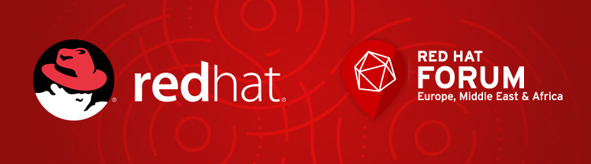

# Red Hat Forum London: Agile Cloud Migration with Ansible

We're excited to announce that our very own Luke Morton is going to be giving a talk at this year's [Red Hat Forum London](https://www.redhat.com/en/about/events/red-hat-forum-united-kingdom-2017), on October 3rd.

Entitled "Agile Cloud Migration with Ansible", Luke will be discussing our experiences using Ansible to perform cloud migrations in an agile way. Organisations of all sizes are finding themselves faced with the considerable challenge of migrating a number of legacy applications to the cloud, and often with a lack of migration experience.

We've found that the answer lies in not treating a migration as a single, monolithic and risky task. By taking a number of smaller steps and prioritising the elements that need to be moved to the cloud, we've been able to reduce risk and build both confidence and experience within organisations that are trying to make such a change.

If you'd like to hear more and throw some questions his way, Luke will be giving the talk **at 13:45 in the Pepys Suite**, as part of the Specialist Breakout sessions taking place on the day.

## About Red Hat Forum London

Red Hat Forum London is the premier UK open source technology event to showcase the latest and greatest in cloud computing, platform, virtualization, middleware, storage, and systems management technologies. The event brings together IT decision makers, architects and developers (to name a few) to discuss hybrid cloud, devops, containers and many more topics that are driving innovation.

## Come and say hello!

As a sponsor of the event, outside of the talk you'll find us at our stand, where we welcome the chance to speak with anyone who'd like to find out more about overcoming the challenges involved in migrating legacy applications to the cloud, and how Ansible can help. We'll also be handing out copies of our new book, [Building High Performance Agile Teams](https://www.madetech.com/resources/ebook/building_high_performance_agile_teams), so feel free to stop by and grab yours.

## Key info

- **Topic:** Agile Cloud Migration with Ansible, by Luke Morton
- **Time:** 13:45
- **Location:** Pepys Suite

We look forward to seeing you there!